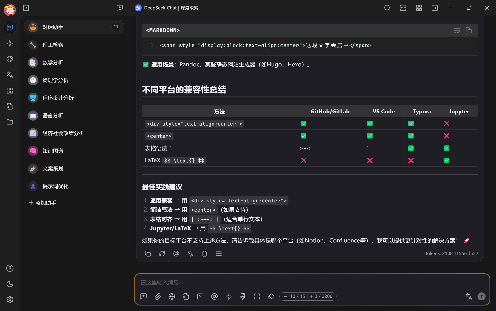

# Maple Neon: A Theme for Cherry Studio

English |
<a href="https://github.com/BoningtonChen/CherryStudio_themes/blob/master/docs/README.zh.md">中文</a> |
<a href="https://github.com/BoningtonChen/CherryStudio_themes/blob/master/docs/README.fr.md">Français</a> |
<a href="https://github.com/BoningtonChen/CherryStudio_themes/blob/master/docs/README.ja.md">日本語</a>

## Introduction
This is a theme tailored for Cherry Studio, a desktop client that supports for multiple LLM providers, available on Windows, Mac and Linux. \
For more information about Cherry Studio, check [here](https://github.com/CherryHQ/cherry-studio).

## How to USE
1. (Recommended but not necessary) Download Maple Mono NF CN from [Maple Font](https://github.com/subframe7536/maple-font/releases/download/v7.3/MapleMono-NF-CN-unhinted.zip). If you do not like the font, the default fallback font should be `Fira Code`.
2. (Recommended but not necessary) Download Harmony OS Sans from [Harmony OS Sans](https://developer.huawei.com/images/download/general/HarmonyOS-Sans.zip). If you do not like the font, the default fallback font should be the font of your system UI.
3. Copy the content in [maple-neon.scss](./themes/maple-neon.scss) file(for original version) or download the raw file(for customization).
4. Paste it into Cherry Studio.
5. Here you go!

## What's special about the theme?
- It provides modernized and aesthetic UI for Cherry Studio.
- It mixes the Maple font with a neon-styled input-bar, creating a unique and visually appealing experience.

## Demonstration
Based on Cherry Studio v1.2.4

## Customization
You can fork the project and modify your own theme for Cherry Studio, for exact instructions, check [Cherry Studio Docs](https://docs.cherry-ai.com/personalization-settings/css).

## One more Glance
For other themes, check [One More Glance](./OneMoreGlance.md)

## Inspiration
### Themes
- Dracula Theme: https://cherrycss.com
- Neon Theme: https://cherry-ai.com/css

### Fonts
- Maple Font: https://github.com/subframe7536/maple-font
- HarmonyOS Sans: https://developer.huawei.com/consumer/cn/design/resource/

### Tools
- The Themes are constructed partly under the help of DeepSeek-0324 & Claude-3.7. 

## LICENSE
The Project follows [MIT LICENSE](./LICENSE).
