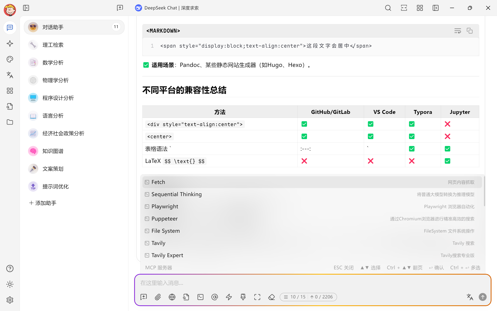

# Maple Neon：Cherry Studio 的主题

中文 |
<a href="https://github.com/BoningtonChen/CherryStudio_themes/blob/master/README.md">English</a> |
<a href="https://github.com/BoningtonChen/CherryStudio_themes/blob/master/docs/README.fr.md">Français</a>

## 介绍
这是专为 Cherry Studio 设计的主题。

## 使用方法
1. (推荐) 下载 [Maple 字体](https://github.com/subframe7536/maple-font/releases)。
2. 复制[maple-neon.css](../maple-neon.css) 文件（原始版本）中的内容，或下载原始文件（用于定制）。
3. 将其粘贴到 Cherry Studio 中。
4. 完成！

## 特别之处？
- 为Cherry Studio提供现代且美观的用户界面。
- 将Maple字体与霓虹风格的输入栏相结合，打造独特且视觉效果出众的使用体验。

## 展示
基于Cherry Studio v1.2.4

## 自定义
您可以 fork 该项目并修改自己的 Cherry Studio 主题，具体说明请查看 [Cherry Studio 文档](https://docs.cherry-ai.com/personalization-settings/css)。

## 灵感来源
### 主题
- Dracula Theme: https://cherrycss.com
- Neon Theme: https://cherry-ai.com/css

### 字体
- Maple Font: https://github.com/subframe7536/maple-font

## LICENSE
本项目遵循 [MIT LICENSE](../LICENSE)。